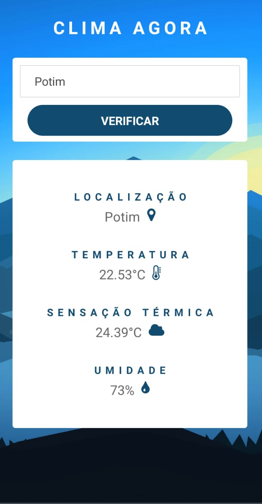

<h1 align="center">
  
<br>
Clima Agora
</h1>

<p align="center"> 🚀 A mobile application to search the climate conditions of any Brazil's city
<p align="center">
  <a href="https://opensource.org/licenses/MIT">
    
  </a>
</p>

## Features

- ⚛️ **React Native** — Javascript lib to create de interfaces.

## Getting started

To start App using React Native use the commands:
```bash
# You do NOT need to run the bottom line if you already have Expo (CLI) installed
yarn global add install expo-cli
yarn install
yarn start
```
Assim que o processo terminar, automaticamente será aberta no seu navegador a página `localhost:19002`. Conecte seu emulador, ou teste o aplicativo por `LAN`: baixe o aplicativo *Expo* da Play Store ou App Store e em seguida escaneie o código QR.
Once the process is finished, the `localhost: 19002` page will automatically open in your browser. Connect your emulator, or test the app via `LAN`: download the * Expo * app from the Play Store or App Store and then scan the QR code.

## How to contribute
- First leave a ⭐!
- Fork the repositories in production as they are updated: <a href="https://github.com/guilhermeorcezi/todolist"> MonoRepo;</a>
- Create a branch with your feature: `git checkout -b my-feature`;
- Commit your changes: `git commit -m 'feat: My new feature'`;
- Push to your branch: `git push origin my-feature`.

## License

This project is licensed by MIT License - Go to the [licence page](https://opensource.org/licenses/MIT) to see more details.
